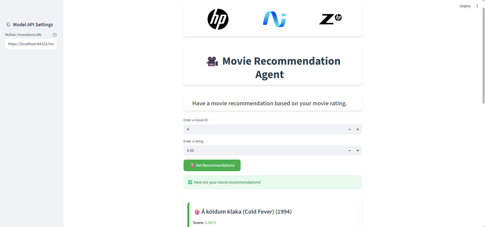

# 🎥 Recommender Systems with Tensorflow

<div align="center">


</div>

## 📚 Contents

- [🧠 Overview](#overview)
- [🗂 Project Structure](#project-structure)
- [⚙️ Setup](#setup)
- [🚀 Usage](#usage)
- [📞 Contact and Support](#contact-and-support)

---

# Overview

This project builds a simple **recommender system** for movies using **TensorFlow**.  
It trains on user-item interaction data to predict movie preferences with Model-based Collaborative Filtering.

---

# Project Structure

```
├── configs/
│   └── config.yaml                                                   # Configuration management
├── demo/
│   ├── streamlit/                                                    # Streamlit UI for deployment
│   │   ├── assets/                                                   # Logo assets
│   │   ├── main.py                                                   # Streamlit application
│   │   └── ...                                                       # Additional Streamlit files
├── docs/
│   └── streamlit-ui-for-recommender-system.pdf                       # UI screenshot
│   └── streamlit-ui-for-recommender-system.png                       # UI screenshot
│   ├── swagger-ui-recommendation-system-with-tensorflow.pdf          # Swagger UI screenshot
│   └── swagger-ui-recommendation-system-with-tensorflow.pdf          # Swagger UI screenshot
├── notebooks/
│   └── register-model.ipynb                                          # Notebook for registering trained models to MLflow
│   └── run-workflow.ipynb                                            # Notebook for executing the pipeline using custom inputs and configurations
├── src/
│   └── utils.py                                                      # Utility functions for configuration and helpers
├── README.md                                                         # Project documentation
```

---

# Setup

### Step 0 ▪ Minimum Hardware Requirements

Ensure your environment meets the minimum compute requirements for smooth image classification performance:

- **RAM**: 16 GB
- **VRAM**: 4 GB
- **GPU**: NVIDIA GPU

### Step 1 ▪ Create an AI Studio Project

- Create a new project in [Z by HP AI Studio](https://zdocs.datascience.hp.com/docs/aistudio/overview).

### Step 2 ▪ Set Up a Workspace

- Choose **Deep Learning** as the base image.

### Step 3 ▪ Download the Dataset

- Download the `tutorial_data dataset`

  - **Asset Name**: `tutorial`
  - **Source**: `AWS S3`
  - **S3 URI**: `s3://dsp-demo-bucket/tutorial_data/`
  - **Resource Type**: `public`
  - **Bucket Region**: `us-west-2`

- Make sure that the dataset is in the datafabric folder inside your workspace. If the dataset does not appear after downloading, please restart your workspace.

### Step 4: Clone the Repository

1. Clone the GitHub repository:

   ```
   git clone https://github.com/HPInc/AI-Blueprints.git
   ```

2. Ensure all files are available after workspace creation.

---

# Usage

### 1 ▪ Run the Notebook

Execute the notebook inside the `notebooks` folder:

```bash
run-workflow.ipynb
```

This will:

- Load and prepare the data
- Create the model architecture
- Train the model
- Make inference

### 2 ▪ Run the Notebook

Execute the notebook inside the `notebooks` folder:

```bash
register-model.ipynb
```

This will:

- Log Model to MLflow
- Fetch the Latest Model Version from MLflow
- Load the Model and Run Inference

### 3 ▪ Deploy the Movie Recommendation Agent Service

- Go to **Deployments > New Service** in AI Studio.
- Name the service and select the registered model.
- Choose a model version and **GPU** it's **not necessary**.
- Choose the workspace.
- Start the deployment.
- Note: This is a local deployment running on your machine. As a result, if API processing takes more than a few minutes, it may return a timeout error. If you need to work with inputs that require longer processing times, we recommend using the provided notebook in the project files instead of accessing the API via Swagger or the web app UI.

### 4 ▪ Swagger / raw API

Once deployed, access the **Swagger UI** via the Service URL.

Paste a payload like:

```
{
  "inputs": {
    "movie_id": [
      2
    ],
    "rating": [
      2.5
    ]
  },
  "params": {}
}
```

And as response:

```
{
  "predictions": [
    [
      "Á köldum klaka (Cold Fever) (1994)",
      4.699822846736677
    ],
    [
      "unknown",
      3.8581945760877083
    ],
    [
      "Zeus and Roxanne (1997)",
      4.688325397321824
    ],
    [
      "Young Poisoner's Handbook, The (1995)",
      4.251002418730941
    ],
    [
      "Young Guns II (1990)",
      1.958771868681974
    ]
  ]
}
```

### 5 ▪ Launch the Streamlit UI

1. To launch the Streamlit UI, follow the instructions in the README file located in the `demo/streamlit` folder.

2. Navigate to the shown URL and view the handwritten classification.

### Successful UI demo

- Streamlit
  

---

# Contact and Support

- Issues: Open a new issue in our [**AI-Blueprints GitHub repo**](https://github.com/HPInc/AI-Blueprints).

- Docs: Refer to the **[AI Studio Documentation](https://zdocs.datascience.hp.com/docs/aistudio/overview)** for detailed guidance and troubleshooting.

- Community: Join the [**HP AI Creator Community**](https://community.datascience.hp.com/) for questions and help.

---

> Built with ❤️ using [**HP AI Studio**](https://www.hp.com/us-en/workstations/ai-studio.html).
