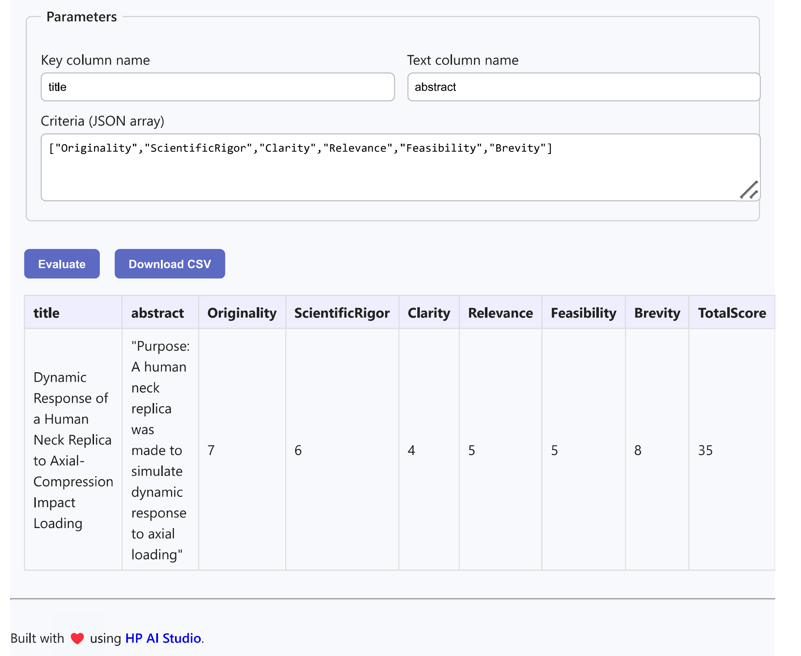
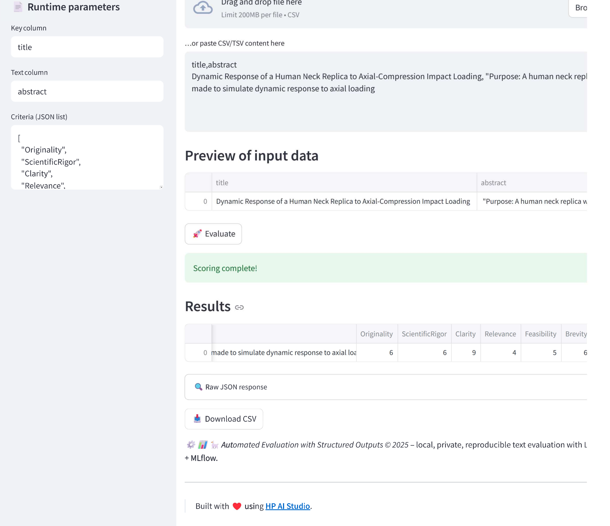

# 📊 Automated Evaluation with Structured Outputs

# 📚 Contents

- [🧠 Overview](#overview)
- [🗂 Project Structure](#project-structure)
- [⚙️ Setup](#setup)
- [🚀 Usage](#usage)
- [📞 Contact and Support](#contact-and-support)

---

## Overview

**Automated Evaluation with Structured Outputs** turns a local **Meta‑Llama‑3** model into an MLflow‑served scorer that rates any batch of texts (e.g., project abstracts) against arbitrary rubric criteria.
The pipeline:

- Generates scores locally via `llama.cpp` (no data leaves your machine)
- Registers the evaluator as a **pyfunc** model in MLflow
- Exposes a REST `/invocations` endpoint
- Ships two front‑ends — a **Streamlit** dashboard and a pure **HTML/JS** UI — for instant human‑friendly interaction and CSV download.

---

## Project Structure

```
├── data                                                                
│   ├── inputs
│   │   ├── 2025 ISEF Project Abstracts.csv # Data assets for the project
├── demo
│   ├── index.html                 # Lightweight HTML/JS UI
│   └── streamlit-webapp/          # Streamlit UI
├── docs/
│   ├── html_ui_for_automated_evaluation.png          # UI screenshot
│   ├── streamlit_ui_for_automated_evaluation.png          # UI screenshot
│   ├── sample-html-ui.pdf          # UI pdf
│   └── sample-streamlit-ui.pdf          # UI pdf
├── notebooks
│   ├── register-model.ipynb   # One‑click notebook for registering trained models to MLflow, generating API logic, and testing the registration.
│   └── run-workflow.ipynb   # One‑click notebook for executing the pipeline using custom inputs and configurations.
├── README.md
└── requirements.txt
```

---

## Setup

### 0 ▪ Minimum hardware

- RAM: 64 GB
- VRAM: 12 GB
- GPU: NVIDIA GPU

### 1 ▪ Create an AI Studio project

Log into [HP AI Studio](https://zdocs.datascience.hp.com/docs/aistudio/overview) and start a **Local GenAI** workspace.

### 2 ▪ Clone the repo

```bash
git clone https://github.com/HPInc/AI-Blueprints.git
```

### 3 ▪ Add the Llama‑3 model

- Download the Meta Llama 3.1 model with 8B parameters via Models tab:

  - **Model Name**: `meta-llama3.1-8b-Q8`
  - **Model Source**: `AWS S3`
  - **S3 URI**: `s3://149536453923-hpaistudio-public-assets/Meta-Llama-3.1-8B-Instruct-Q8_0`
  - **Bucket Region**: `us-west-2`

- Make sure that the model is in the `datafabric` folder inside your workspace. If the model does not appear after downloading, please restart your workspace.

---

## Usage

### 1 ▪ Run the notebook

Open **`notebooks/run-workflow.ipynb`**, run all cells.
This will:

1. Load the GGUF model
2. Setup the pipeline

### 2 ▪ Deploy the Service

Open **`notebooks/register-model.ipynb`**, run all cells.
This will:

1. Log the model to MLflow
2. Run the inference with logged model

- Go to **Deployments > New Service** in AI Studio.
- Name the service and select the registered model.
- Choose a model version and enable **GPU acceleration**.
- Start the deployment.
- Note: This is a local deployment running on your machine. As a result, if API processing takes more than a few minutes, it may return a timeout error. If you need to work with inputs that require longer processing times, we recommend using the provided notebook in the project files instead of accessing the API via Swagger or the web app UI.

### 3 ▪ Swagger / raw API

Once deployed, access the **Swagger UI** via the Service URL.

Paste a payload like:

```jsonc
{
  "dataframe_split": {
    "columns": ["title", "abstract"],
    "data": [
      ["TEST001", "Microplastics impact on marine life"],
      ["TEST002", "Low‑cost solar charger for off‑grid use"]
    ]
  },
  "params": {
    "key_column": "title",
    "eval_column": "abstract",
    "criteria": "[\"Originality\",\"ScientificRigor\",\"Clarity\",\"Relevance\",\"Feasibility\",\"Brevity\"]",
    "batch_size": 2
  }
}
```

### 4 ▪ Use the HTML UI

From the Swagger page, click the demo link to interact with the locally deployed model via UI.

### 5 ▪ Launch the Streamlit UI

1. To launch the Streamlit UI, follow the instructions in the README file located in the `demo/streamlit-webapp` folder.

2. Navigate to the shown URL, upload a CSV, tweak parameters, and view scores.

### Successful UI Screenshots

- HTML
  

- Streamlit
  

---

# Contact and Support

- **Troubleshooting:** Refer to the [**Troubleshooting**](https://github.com/HPInc/AI-Blueprints/tree/main?tab=readme-ov-file#troubleshooting) section of the main README in our public AI-Blueprints GitHub repo for solutions to common issues.

- **Issues & Bugs:** Open a new issue in our [**AI-Blueprints GitHub repo**](https://github.com/HPInc/AI-Blueprints).

- **Docs:** [**AI Studio Documentation**](https://zdocs.datascience.hp.com/docs/aistudio/overview).

- **Community:** Join the [**HP AI Creator Community**](https://community.datascience.hp.com/) for questions and help.

---

> Built with ❤️ using [**HP AI Studio**](https://hp.com/ai-studio).