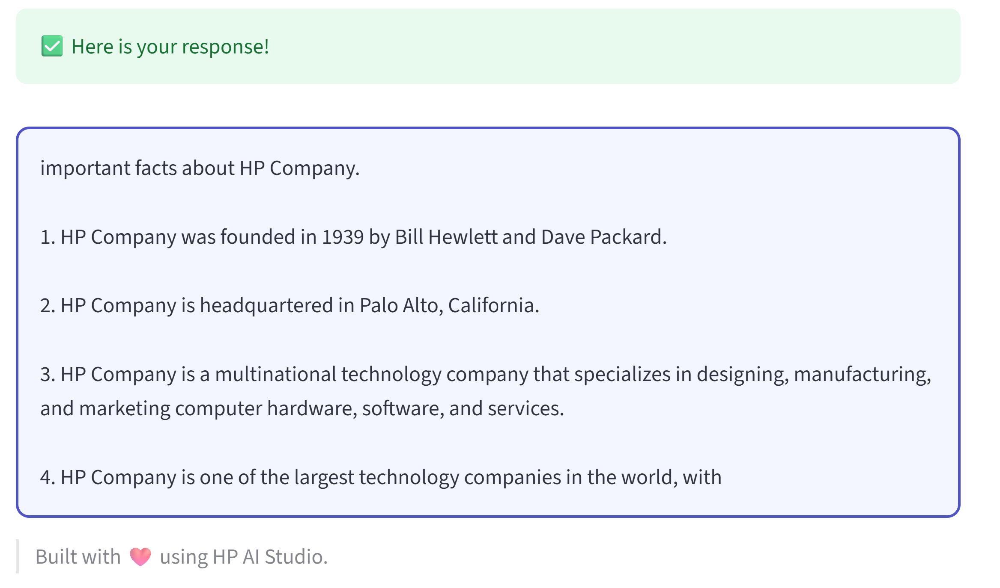

# Interactive ORPO Fine-Tuning & Inference Hub for Open LLMs

<div align="center">


</div>

## 📚 Contents

- [🧠 Overview](#overview)
- [🗂 Project Structure](#project-structure)
- [⚙️ Configuration](#configuration)
- [🔧 Setup](#setup)
- [🚀 Usage](#usage)
- [📞 Contact and Support](#contact-and-support)

---

## Overview

This project demonstrates a full-stack LLM fine-tuning experiment using ORPO (Open-Source Reinforcement Pretraining Objective) to align a base language model with human preference data. It leverages the **Z by HP AI Studio Local GenAI environment**, and uses models such as LLaMA 3, Gemma 1B, and Mistral 7B as foundations.

We incorporate:

- **TensorBoard** for human feedback visualization before fine-tuning
- A flexible model selector and inference runner architecture
- A comparative setup to benchmark base vs fine-tuned models on the same prompts
- Detailed model comparison tools for quality evaluation

---

## Project Structure

```text
├── configs
│   ├── default_config_cpu.yaml
│   ├── default_config_multi-gpu.yaml
│   ├── default_config_one-gpu.yaml
│   └── config.yaml                                                     # Blueprint configuration (UI mode, ports, service settings)
├── core                                                                # Core Python modules
│   ├── comparer
│   │   └── model_comparer.py
│   ├── data_visualizer
│   │   └── feedback_visualizer.py
│   ├── deploy
│   │   └── deploy_fine_tuning.py
│   ├── finetuning_inference
│   │   └── inference_runner.py
│   ├── local_inference
│   │   └── inference.py
│   ├── ggml_convert
│   │   └── convert-lora-to-ggml.py
│   │   └── convert.py
│   ├── selection
│   │   └── model_selection.py
│   ├── target_mapper
│   │   └── lora_target_mapper.py
│   └── fine_tuning_service.py                                          # Fine-tuning service implementation
├── demo/                                                               # Compiled Interface Folder
├── docs
│   ├── successful-swagger-ui-fine-tuning-result.pdf                    # Swagger screenshot 
│   ├── streamlit-fine-tuning-with-orpo.pdf                             # Streamlit screenshot
│   ├── streamlit-fine-tuning-with-orpo.png                             # Streamlit screenshot
├── notebooks
│   ├── register-model.ipynb                                            # Model registration and deployment notebook
│   └── run-workflow.ipynb                                              # Main workflow notebook for ORPO fine-tuning
├── src
│   ├── __init__.py
│   └── utils.py                                                        # Utility functions for config loading
├── README.md
└── requirements.txt
```

---

## Configuration

The blueprint uses a centralized configuration system through `configs/config.yaml`:

```yaml
ui:
  mode: streamlit # UI mode: streamlit or static
  ports:
    external: 8501 # External port for UI access
    internal: 8501 # Internal container port
  service:
    timeout: 30 # Service timeout in seconds
    health_check_interval: 5 # Health check interval in seconds
    max_retries: 3 # Maximum retry attempts
```

---

## Setup

### Step 0: Minimum Hardware Requirements

To ensure smooth execution and reliable model deployment, make sure your system meets the following **minimum hardware specifications** based on the selected model and task (inference or fine-tuning):

### ✅ Model Hardware Matrix

| **Model**                             | **Task**    | **Min VRAM** | **Min RAM** | **GPU Recommendation**           |
| ------------------------------------- | ----------- | ------------ | ----------- | -------------------------------- |
| `mistralai/Mistral-7B-Instruct-v0.1`  | Inference   | 12 GB        | 32 GB       | RTX 3080, A100 (for 4-bit QLoRA) |
|                                       | Fine-tuning | 40–48+ GB    | 64+ GB      | RTX 4090, A100, H100             |
| `meta-llama/Llama-2-7b-chat-hf`       | Inference   | 6 GB         | 32 GB       | RTX 3080 or better               |
|                                       | Fine-tuning | 40–48+ GB    | 64+ GB      | RTX 4090+                        |
| `meta-llama/Meta-Llama-3-8B-Instruct` | Inference   | 16 GB        | 32 GB       | RTX 3090, 4090                   |
|                                       | Fine-tuning | 64+ GB       | 64–96 GB    | Dual RTX 4090 or A100            |
| `google/gemma-7b-it`                  | Inference   | 12 GB        | 32 GB       | RTX 3080 or better               |
|                                       | Fine-tuning | 40+ GB       | 64 GB       | RTX 4090                         |
| `google/gemma-3-1b-it`                | Inference   | 8 GB         | 16–24 GB    | RTX 3060 or better               |
|                                       | Fine-tuning | 16–24 GB     | 32–48 GB    | RTX 3080 / 3090                  |

> ⚠️ These recommendations are based on community benchmarks and documentation provided by Hugging Face, Unsloth, and Google. For production workloads, always monitor VRAM/RAM usage on your system.

### Step 1: Create an AI Studio Project

- Create a new project in [Z by HP AI Studio](https://zdocs.datascience.hp.com/docs/aistudio/overview).

### Step 2: Set Up a Workspace

- Choose **Local GenAI** as the base image.

### Step 3: Clone the Repository

```bash
git clone https://github.com/HPInc/AI-Blueprints.git

```

- Ensure all files are available after workspace creation.

### Step 5: Configure Secrets

- **Configure Secrets in YAML file (Freemium users):**
  - Create a `secrets.yaml` file in the `configs` folder and list your API keys there:
    - `HUGGINGFACE_API_KEY`: Required to use Hugging Face-hosted models instead of a local model.

- **Configure Secrets in Secrets Manager (Premium users):**
  - Add your API keys to the project's Secrets Manager vault, located in the `Project Setup` tab -> `Setup` -> `Project Secrets`:
    - `HUGGINGFACE_API_KEY`: Required to use Hugging Face-hosted models instead of a local model.
  - In `Secrets Name` field add: `HUGGINGFACE_API_KEY`
  - In the `Secret Value` field, paste your corresponding key generated by HuggingFace.

  <br>

  **Note: If both options (YAML option and Secrets Manager) are used, the Secrets Manager option will override the YAML option.**

### Step 6: Setup Configuration

1. Edit `config.yaml` with relevant configuration details:
  - `model_source`: Choose between `local`, `hugging-face-cloud`, or `hugging-face-local`
  - `ui.mode`: Set UI mode to `streamlit` or `static`
  - `ports`: Configure external and internal port mappings
  - `service`: Adjust MLflow timeout and health check settings
  - `proxy`: Set proxy settings if needed for restricted networks

---

## Usage

### Step 1: Run the Main Workflow

Execute the main workflow notebook inside the `notebooks` folder:

```bash
notebooks/run-workflow.ipynb
```

This notebook will:

- Select and download a compatible model from Hugging Face
- Apply QLoRA configuration and prepare the model for training
- Run the fine-tuning using ORPO (Optimal Reward Preferring Optimization)
- Perform evaluation and comparison between the base and fine-tuned models
- Generate comparative analysis and metrics


**Disclaimer**: The number of training steps and the size of training and validation datasets has been intentionally reduced to optimize computational efficiency and minimize training time. However, these parameters can be adjusted if further model performance improvements are desired. 

### Step 2: Register the Models for Deployment

Only after executing the 'run-workflow' notebook inside the `notebooks` folder, execute the 'register-model' notebook:

```bash
notebooks/register-model.ipynb
```

This notebook will:

- Register both base and fine-tuned models in MLflow Model Registry
- Create a comparison service that can switch between base and fine-tuned models
- Provide deployment-ready model artifacts with proper versioning
- Include usage examples and API documentation

### Step 3: Deploy the Model Service

- Go to **Deployments > New Service** in AI Studio.
- Name the service and select the registered model from MLflow.
- Choose a model version and enable **GPU acceleration**.
- Start the deployment.
- Once deployed, access the **Swagger UI** via the Service URL.

The deployed service will allow you to:

- Send prompts to either the base or fine-tuned model
- Compare outputs between both models
- Use the same API endpoint for both model variants


### Step 4: Launch the Streamlit UI

1. To launch the Streamlit UI, follow the instructions in the README file located in the `demo/streamlit` folder.

2. Navigate to the shown URL and view the fine tuning with orpo.

### Successful UI demo

- Streamlit

  


---

## Contact and Support

- Issues & Bugs: Open a new issue in our [**AI-Blueprints GitHub repo**](https://github.com/HPInc/AI-Blueprints).

- Docs: [**AI Studio Documentation**](https://zdocs.datascience.hp.com/docs/aistudio/overview).

- Community: Join the [**HP AI Creator Community**](https://community.datascience.hp.com/) for questions and help.

---

> Built with ❤️ using [**Z by HP AI Studio**](https://www.hp.com/us-en/workstations/ai-studio.html).
