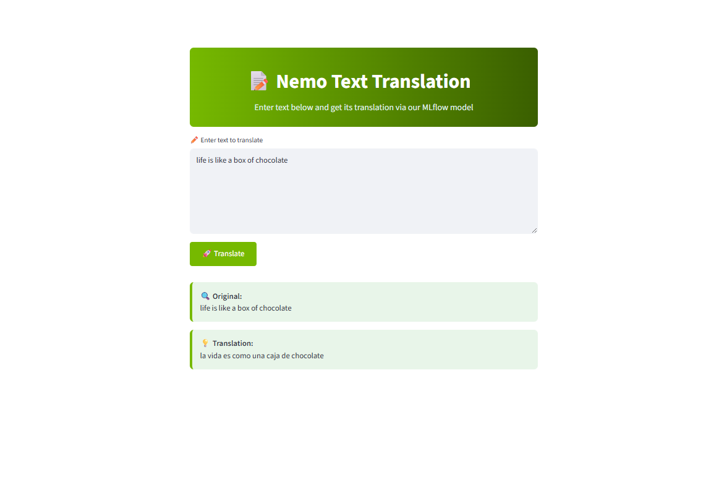

# 🎙️ Audio Translation with NeMo Models

<div align="center">


</div>

# 📚 Contents

- [🧠 Overview](#overview)
- [🗂 Project Structure](#project-structure)
- [⚙️ Setup](#setup)
- [🚀 Usage](#usage)
- [� Model Export Configuration](#model-export-configuration)
- [�📞 Contact and Support](#contact-and-support)

---

## Overview

This project demonstrates an end-to-end **audio translation pipeline** using **NVIDIA NeMo models**. It takes an English audio sample and performs:

1. **Speech-to-Text (STT)** conversion using Citrinet
2. **Text Translation (TT)** from English to Spanish using opus-mt-en-es
3. **Text-to-Speech (TTS)** synthesis in Spanish using FastPitch and HiFiGAN

All steps are GPU-accelerated, and the full workflow is integrated with **MLflow** for experiment tracking and model registration.

---

## Project Structure

```
├── configs/                                                        # Configuration files
│   └── config.yaml                                                 # Blueprint configuration (UI mode, ports, service settings)
├── data                                                            # Data assets used in the project
│   ├── ForrestGump.mp3
│   └── June18.mp3
├── demo                                                            # UI-related files
│   ├── static/                                                     # Static HTML UI files
│   └── streamlit/                                                  # Streamlit webapp files
├── docs
│   ├── successful-streamlit-ui-audio-translation-result.pdf        # Streamlit UI screenshot pdf file
│   └── successful-swagger-ui-audio-translation-result.pdf          # Swagger UI screenshot pdf file
├── notebooks
|   ├── register-model.ipynb                                        # Notebook for registering trained models to MLflow
│   └── run-workflow.ipynb                                          # Notebook for executing the pipeline using custom inputs and configurations
├── README.md                                                       # Project documentation
└── requirements.txt                                                # Python dependencies (used with pip install)
```

---

## Setup

### 0 ▪ Minimum Hardware Requirements

Ensure your environment meets the minimum hardware requirements for smooth model inference:

- RAM: 16 GB
- VRAM: 8 GB
- GPU: NVIDIA GPU

### 1 ▪ Create an AI Studio Project

- Create a new project in [Z by HP AI Studio](https://zdocs.datascience.hp.com/docs/aistudio/overview).

### 2 ▪ Set Up a Workspace

- Choose the **NeMo Framework** image from the **NVIDIA NGC Catalog** in AI Studio during workspace setup.

### 3 ▪ Clone the Repository

```bash
https://github.com/HPInc/AI-Blueprints.git
```

- Ensure all files are available after workspace creation.

### 4 ▪ Add Required NeMo Models

From the **Models** tab, add the following models from the model catalog in AI Studio:

1. **Speech-to-Text (STT)**

   - Model: `stt_en_citrinet_1024_gamma_0_25-1.0.0`
   - Asset Name: `STT En Citrinet 1024 Gamma 0.25`

2. **Text-to-Speech (TTS)**
   - Model: `tts_es_multispeaker_fastpitchhifigan-1.15.0`
   - Asset Name: `TTS Es Multispeaker FastPitch HiFiGAN`

Make sure these models are downloaded and available in the `datafabric` folder inside your workspace.

---

## Usage

### 1 ▪ Run the Workflow Notebook

Open and run the notebook located at:

```bash
notebooks/run-workflow.ipynb
```

This will:

- Load STT, Helsinki-NLP, and TTS models from the NGC assets
- Convert an English audio file to English text
- Translate the text into Spanish
- Synthesize spoken Spanish audio from the translated text

Ensure that in **Translate the Text**, you include the step **Extract the text from the first hypothesis**, according to the NeMo version.

### 2 ▪ Run the Register Model Notebook

Execute the notebook inside the `notebooks` folder:

```bash
register-model.ipynb
```

This will:

- Log the entire workflow as a composite model in **MLflow**
- Fetch the Latest Model Version from MLflow
- Load the Model and Run Inference

### 3 ▪ Deploy the Nemo Translation Service

- In AI Studio, navigate to **Deployments > New Service**.
- Give your service a name (e.g. “NemoTranslation”), then select the registered NemoTranslationModel.
- Pick the desired model version and enable **GPU acceleration** for best performance.
- Click **Deploy** to launch the service.

The model here can also be exported in ONNX format alongside the MLflow pyfunc format. For more details, please refer to the ONNX-README in the docs folder.

### 4 ▪ Swagger / Raw API

Once your service is running, open the **Swagger UI** from its Service URL.

#### Example payload for text-only translation:

```jsonc
{
  "dataframe_records": [
    {
      "source_text": "Hello, world!",
      "source_serialized_audio": ""
    }
  ],
  "parameters": {
    "use_audio": false
  }
}
```

Paste that into the Swagger “/invocations” endpoint and click **Try it out** to see the raw JSON response.

### 5 ▪ Use the HTML Demo

From the Swagger page, click the **“Demo”** link to interact via a simple web form:

- Enter your source text.
- Click **Translate**.
- View the translated text right in the browser.

### 6 ▪ Launch the Streamlit UI

1. To launch the Streamlit UI, follow the instructions in the README file located in the `demo/streamlit-webapp` folder.
2. Enter text to translate, hit **Translate**, and enjoy the live results!

### Successful UI demo


---

# Contact and Support

- Issues: Open a new issue in our [**AI-Blueprints GitHub repo**](https://github.com/HPInc/AI-Blueprints).

- Docs: Refer to the **[AI Studio Documentation](https://zdocs.datascience.hp.com/docs/aistudio/overview)** for detailed guidance and troubleshooting.

- Community: Join the [**HP AI Creator Community**](https://community.datascience.hp.com/) for questions and help.

---

> Built with ❤️ using [**HP AI Studio**](https://www.hp.com/us-en/workstations/ai-studio.html).
