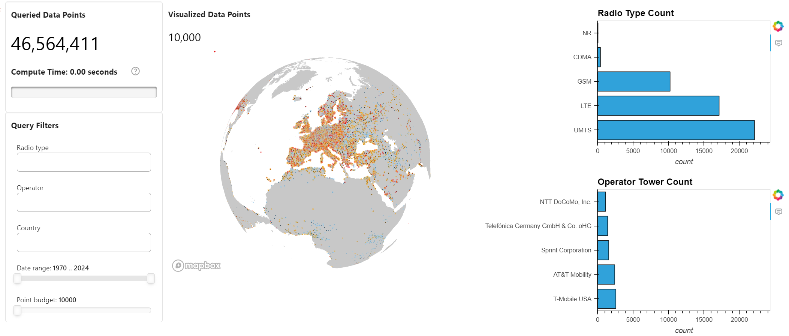

# 📡 OpenCellID Exploratory Data Analysis with Panel and cuDF

<div align="center">


</div>

## 📚 Contents

* [🧠 Overview](#overview)
* [🗂 Project Structure](#project-structure)
* [⚙️ Setup](#setup)
* [🚀 Usage](#usage)
* [📞 Contact and Support](#contact-and-support)

---

## Overview

This project is a GPU-accelerated, interactive **exploratory data analysis (EDA)** dashboard for the [OpenCellID](https://www.opencellid.org/) dataset. It uses **Panel** and **cuDF** to deliver lightning-fast geospatial analysis and visualization.

You can explore cell tower distributions by radio type, operator, country, and time window — rendered live on an interactive map with full GPU acceleration.

---

## Project Structure

```
├── docs
│   └── ui_opencellid.png                                      # opencellid UI screenshot
├── notebooks                                                  # Main notebooks for the project
|   ├── register-model.ipynb
│   └── run-workflow.ipynb               
├── src                                                        # Core Python modules
│   └── opencellid_downloader.py               
├── README.md                                                  # Project documentation
└── requirements.txt                                           # Python dependencies (used with pip install)
```

---

## Setup

### Step 0: Minimum Hardware Requirements

Ensure your environment meets the minimum compute requirements for smooth dashboard rendering and cuDF performance:

- **RAM**: 16 GB  
- **VRAM**: 4 GB  
- **GPU**: NVIDIA GPU

### Step 1: Create an AI Studio Project

- Create a new project in [Z by HP AI Studio](https://zdocs.datascience.hp.com/docs/aistudio/overview).

### Step 2: Set Up a Workspace

- Choose **RAPIDS Base** or **RAPIDS Notebooks** as the base image.

### Step 3: Clone the Repository

```bash
https://github.com/HPInc/AI-Blueprints.git
```

- Ensure all files are available after workspace creation.

---

## Usage

### Step 1: Run the Workflow Notebook

Execute the *run-workflow* notebook inside the `notebooks` folder:

```bash
notebooks/run-workflow.ipynb
```

This will:

- Load the OpenCellID tower data and enrich it with operator metadata  
- Apply GPU-accelerated filters with `cudf.pandas`  
- Launch an interactive dashboard using `panel` and `pydeck` for geospatial rendering  

### Step 2: Use the Dashboard

The notebook launches an embedded interactive dashboard featuring:

- **Filters**: Radio Type, Operator, Country, First Seen (Year), Point Budget  
- **Charts**: Bar plots for radio and operator distributions  
- **Map**: 3D scatterplot of cell tower locations with hover interactivity  
- **Performance Metrics**: Visual indicators for data size and compute time  

### Example Dashboard Snapshot

 

---

### Step 3: Run the Register Notebook

Execute the *register-model* notebook inside the `notebooks` folder:

```bash
notebooks/register-model.ipynb
```

This will:

- Measure the execution time of each analysis step (loading, describing, aggregating, dashboard build) and log those numbers as **MLflow metrics**.
- Save the generated dashboard (`dashboard.html`) and any summary CSV / Parquet files as **MLflow artifacts** so you can download or preview them later.
- Wrap the dashboard in a minimal `mlflow.pyfunc.PythonModel` called **OpenCellID-EDA** and register it in the **MLflow Model Registry**.  
  Loading this model later (`mlflow.pyfunc.load_model("models:/OpenCellID-EDA/latest")`) returns the HTML dashboard, letting you serve or embed it without rerunning the notebook.
- In short, the notebook turns the exploratory workflow into a version-controlled, reproducible asset that can be compared across hardware, datasets or code changes via MLflow’s UI.


## Contact and Support

- Issues: Open a new issue in our [**AI-Blueprints GitHub repo**](https://github.com/HPInc/AI-Blueprints).

- Docs: Refer to the **[AI Studio Documentation](https://zdocs.datascience.hp.com/docs/aistudio/overview)** for detailed guidance and troubleshooting. 

- Community: Join the [**HP AI Creator Community**](https://community.datascience.hp.com/) for questions and help.
---

> Built with ❤️ using [**HP AI Studio**](https://www.hp.com/us-en/workstations/ai-studio.html).