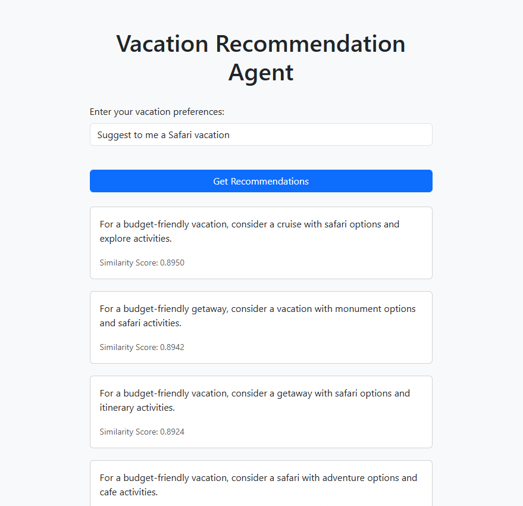

# 🌍 Vacation Recommendation Service

<div align="center">


</div>

## Content

- [🧠 Overview](#overview)
- [🗂 Project Structure](#project-structure)
- [⚙️ Setup](#setup)
- [🚀 Usage](#usage)
- [📞 Contact and Support](#contact-and-support)

## Overview

The **Vacation Recommendation Service** is an AI-powered system designed to provide personalized travel recommendations based on user queries. It utilizes the **NVIDIA NeMo Framework** and **BERT embeddings** to generate relevant suggestions tailored to user preferences.

## Project Structure

```
├── README.md                                                               # Project documentation
├── artifacts                                                               # Artifacts used in the project
|   └── tokenizer                                                           # Directory containing tokens used for NLP
|       ├── special_tokens_map.json
|       ├── tokenizer_config.json
|       ├── tokenizer.json
|       └── vocab.txt
├── configs/                                                                # Configuration files
│   └── config.yaml                                                         # Blueprint configuration (UI mode, ports, service settings)
├── data                                                                    # Data assets used in the project
│   └── raw
│       └── corpus.csv
├── demo                                                                    # UI-related files
│   ├── static/                                                             # Static HTML UI files
│   └── streamlit/                                                          # Streamlit webapp files
├── docs
│   ├── architecture.md                                                     # Model Details and API Endpoints
|   ├── successful-streamlit-ui-bert-vacation-recommendation-result.pdf     # UI screenshot for streamlit UI results
|   ├── successful-swagger-ui-bert-vacation-recommendation-result.pdf       # UI screenshot for swagger UI results
│   └── ui_vacation.png                                                     # UI screenshot
├── notebooks                                                               # Main notebook for the project
│   ├── register-model.ipynb                                                # Notebook for registering trained models to MLflow
|   └── run-workflow.ipynb                                                  # Notebook for generating embeddings and saving the tokenizer
├── src
|   ├──__init__.py
|   └── bert_recommendation_service.py                                       # Recommendation BERT service implementation
└── requirements.txt                                                        # Python dependencies (used with pip install)
```

## Setup

### Step 0: Minimum Hardware Requirements

Ensure your environment meets the minimum compute requirements for smooth dashboard rendering and cuDF performance:

- RAM: 16 GB
- VRAM: 8 GB
- GPU: NVIDIA GPU

### Step 1: Create an AI Studio Project

- Create a new project in [Z by HP AI Studio](https://zdocs.datascience.hp.com/docs/aistudio/overview).

### Step 2: Set Up a Workspace

- Choose **NeMo Framework** as the base image.

### Step 3: Clone the Repository

```bash
https://github.com/HPInc/AI-Blueprints.git
```

- Ensure all files are available after workspace creation.

### Step 4: Add Project Assets

1. Add the **Bertlargeuncased** (not **BertLargeUncasedForNemo**) model from the model catalog in AI Studio to your workspace. Use the `datafabric` folder inside the workspace to work with this model.

### Step 5: Use a Custom Kernel for Notebooks

1. In Jupyter notebooks, select the **aistudio kernel** to ensure compatibility.

## Usage

### Step 1: Generate Embeddings

Run the following notebook to generate word embeddings and save the tokenizer:

- `run-workflow.ipynb`.

### Step 2: Deploy the Service

1. Only after running the 'run-workflow' notebook, execute the `register-model.ipynb` to register the BERT model in MLflow and create the API logic.
2. Navigate to **Deployments > New Service** in AI Studio.
3. Name the service and select the registered model.
4. Choose an available model version and configure it with **GPU acceleration**.
5. Start the deployment.
6. Once deployed, click on the **Service URL** to access the Swagger API page.
7. At the top of the Swagger API page, follow the provided link to open the demo UI for interacting with the locally deployed BERT model.
8. Enter a search query (e.g., _"Suggest a budget-friendly resort vacation."_).
9. Click **Get Recommendations** to view the results.

The model here can also be exported in ONNX format alongside the MLflow pyfunc format. For more details, please refer to the ONNX-README in the docs folder.

### Step 3: Launch the Streamlit UI

1. To launch the Streamlit UI, follow the instructions in the README file located in the demo/streamlit-webapp folder.
2. Navigate to the shown URL and view the vacation recommendation.

### Successful Demonstration of the User Interface



---

## Contact and Support

- Issues: Open a new issue in our [**AI-Blueprints GitHub repo**](https://github.com/HPInc/AI-Blueprints).

- Docs: Refer to the **[AI Studio Documentation](https://zdocs.datascience.hp.com/docs/aistudio/overview)** for detailed guidance and troubleshooting.

- Community: Join the [**HP AI Creator Community**](https://community.datascience.hp.com/) for questions and help.

---

> Built with ❤️ using [**HP AI Studio**](https://www.hp.com/us-en/workstations/ai-studio.html).
